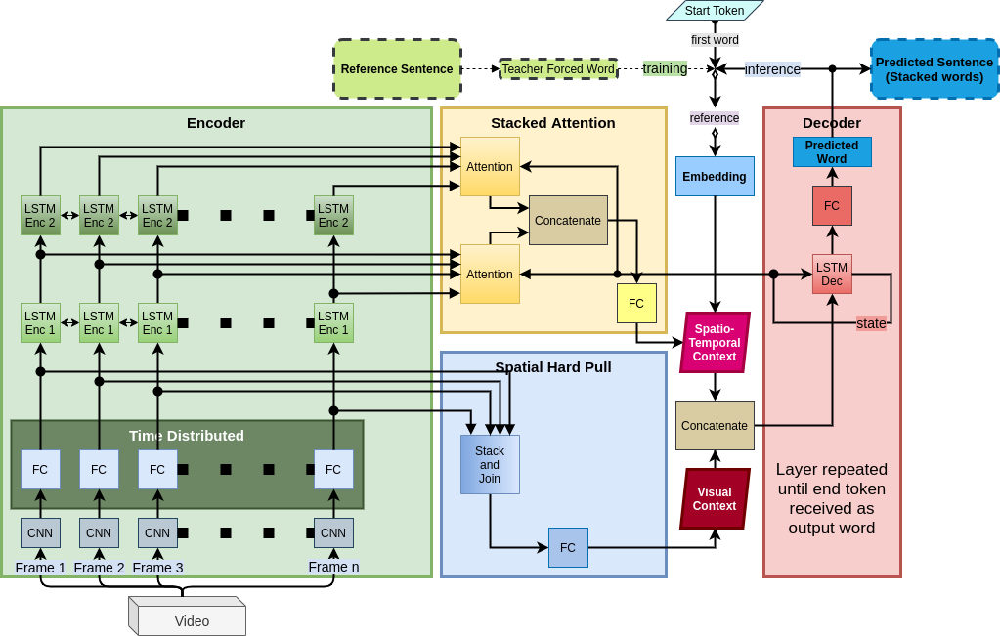
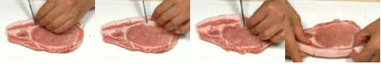
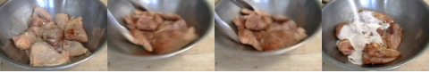

# SS-VideoCaptioning
This repository contains the Tensorflow implementation of our model "Semantically Sensible Video Captioning (SSVC)" 



## Authors
  [Md. Mushfiqur Rahman](https://github.com/mushfiqur11), [Thasin Abedin](), [Khondokar S. S. Prottoy](), [Ayana Moshruba](), [Fazlul Hasan Siddiqui](http://portfolio.duetbd.org/resume/siddiqui/)

## Requirements
Install the following dependencies before running the model
  - Tensorflow 2.0 [install](https://www.tensorflow.org/install)
  - tqdm `pip install tqdm`
  - sklearn `pip install -U scikit-learn`
  - nltk `pip install nltk`

## Directory structure
```
-root
  -glove.6B.100d.txt
  -MSVD_captions.csv
  -models_and_utils
    -models.py
    -utils.py
  -data_picle
    -train
      -filename1.pkl
      -filename2.pkl
      ...
    -test
      -filename1.pkl
      -filename2.pkl
      ...
    -validation
      -filename1.pkl
      -filename2.pkl
      ...
    -train.csv
    -test.csv
    -validation.csv
```

## SSVC
  - Download and extract 'glove.6B.100d.txt' [link](https://nlp.stanford.edu/projects/glove/)
  - Download the [MSVD](https://www.microsoft.com/en-us/download/details.aspx?id=52422&from=https%3A%2F%2Fresearch.microsoft.com%2Fen-us%2Fdownloads%2F38cf15fd-b8df-477e-a4e4-a4680caa75af%2F) dataset and create corresponding pickle files using `vid2frames.ipynb`. Split the data in train-test-val sets.
    > Alternate step: Download and extract ['data_pickle.zip'](https://drive.google.com/file/d/1Srqr1-J8psWae12dyMxsV4pDSNOi41UF/view?usp=sharing). This compressed file already contains the pickles files of MSVD dataset
  - run the train.ipynb file
    > This file has a detailed list of options. Change the options to adjust the model according to requirements
  - Train and evaluation codes are inside the python notebook

## Sample Outputs


<br>
SSVC: "A woman is cutting a piece of meat" <br>
GT: "a woman is cutting into the fatty areas of a pork chop" <br>
SS score: 1.0 , BLEU1: 1.0, BLEU2: 1.0, BLEU3: 1.0, BLEU4: 1.0<br>


<br>
SSVC: "A person is slicing tomato" <br>
GT: "Someone wearing blue rubber gloves is slicing a tomato with a large knife" <br>
SS score: 0.825 , BLEU1: 1.0, BLEU2: 1.0, BLEU3: 1.0, BLEU4: 1.0<br>


<br>
SSVC: "A woman is cutting a piece of meat" <br>
GT: "a woman is cutting into the fatty areas of a pork chop" <br>
SS score: 0.94 , BLEU1: 1.0, BLEU2: 0.84, BLEU3: 0.61, BLEU4: 0.0<br>
